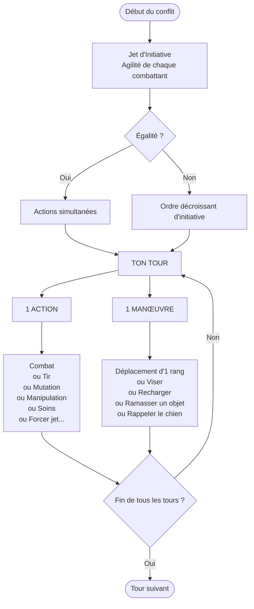
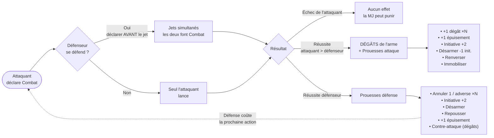
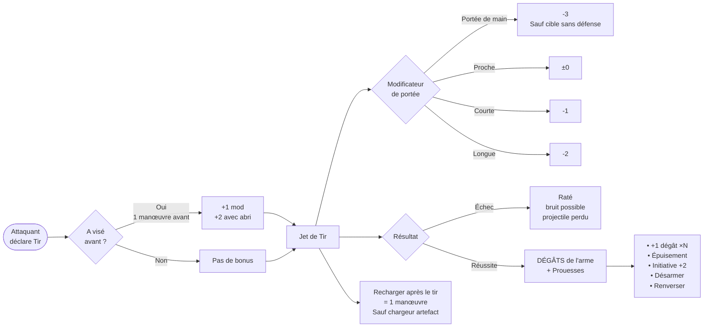
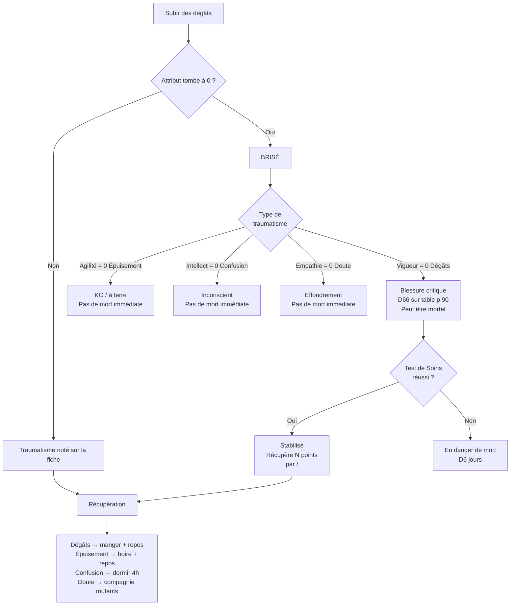
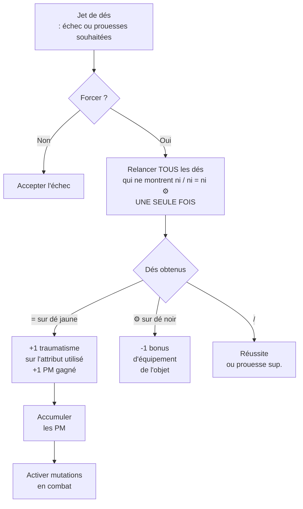
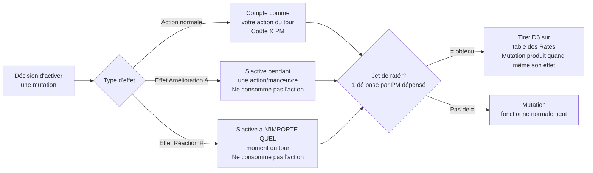
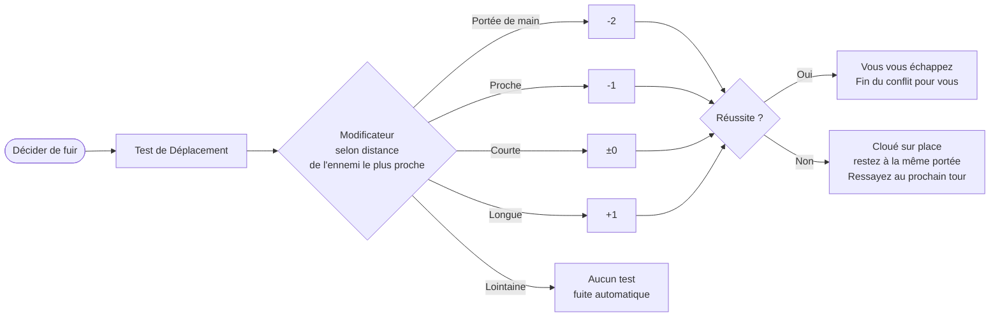
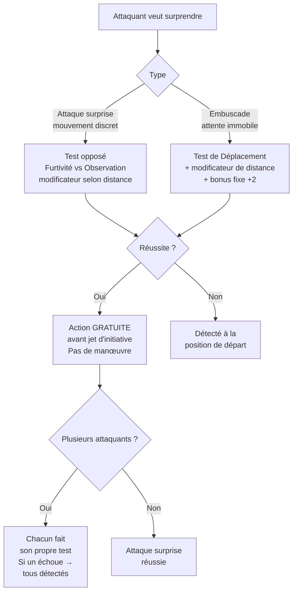
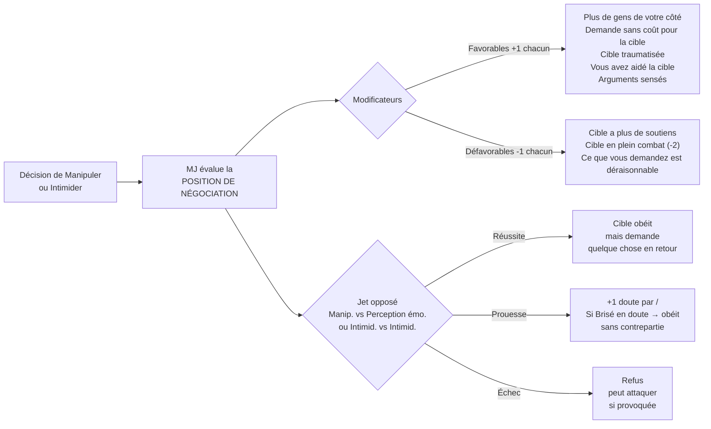

# Résumé — Mécanique de Combat

> Référence rapide pour la MJ. Tous les liens pointent vers les fiches détaillées.

---

## 1. Structure d'un Tour de Conflit

> **Mutation (A) :** peut être activée pendant une action ou manœuvre sans la consommer (effet d'amélioration ou de réaction).

---

## 2. Combat Rapproché

---

## 3. Combat à Distance

---

## 4. Portées et Déplacements

| Zone | Exemples | Déplacement |
|---|---|---|
| **Portée de main** | Corps à corps | — |
| **Proche** | Quelques mètres | 1 manœuvre depuis main |
| **Courte** | Une pièce / ~30 m | 1 manœuvre depuis Proche |
| **Longue** | Visible à l'œil nu | 2 manœuvres depuis Courte |
| **Lointaine** | Hors de portée réaliste | Hors conflit |

> Se déplacer de Courte → Longue coûte **2 manœuvres dans le même tour** (donc aucune action ce tour).

---

## 5. Système de Traumatismes et Brisé

### Les 4 traumatismes

| Traumatisme | Attribut réduit | Sources courantes |
|---|---|---|
| **Dégâts** | Vigueur | Armes, explosions, chutes, acide |
| **Épuisement** | Agilité | Faim, venin, déshydratation |
| **Confusion** | Intellect | Peur, drogues, mutations psy |
| **Doute** | Empathie | Manipulation, Intimidation, Tourmenteur psy |

---

## 6. Forcer un Jet et Points de Mutation

> **Jet forcé interdit** pour : récupérer de Soins sur soi-même, Tenir le coup.

---

## 7. Utiliser les Mutations en Combat

### Table des Ratés des Mutations (rappel)

| D6 | Effet |
|---|---|
| **1** | +1 traumatisme permanent + nouvelle mutation |
| **2** | Vous subissez aussi les effets + même traumatisme que la cible |
| **3** | Coûte 2× les PM (sans effet amélioré) |
| **4** | Mutation bloquée pour le reste de la séance |
| **5** | Modification cosmétique permanente |
| **6** | PM remboursés + réactivation immédiate gratuite |

---

## 8. Fuir un Conflit

> Mutations **Sprinteur**, **Jambes de grenouille** et **Spores** permettent de fuir sans test.

---

## 9. Attaque Surprise et Embuscade

| Distance | Mod. Furtivité | Mod. Embuscade |
|---|---|---|
| Portée de main | -2 | -2 + 2 = ±0 |
| Proche | -1 | -1 + 2 = +1 |
| Courte | ±0 | ±0 + 2 = +2 |
| Longue | +1 | +1 + 2 = +3 |
| Lointaine | +2 | +2 + 2 = +4 |

---

## 10. Conflits Sociaux (Manipulation / Intimidation)

---

## 11. Récapitulatif Rapide — Prouesses par Compétence

| Compétence | 1 seul / | / supplémentaires |
|---|---|---|
| **Combat** (attaque) | Dégâts de l'arme | +dégât · épuisement · init+2 · désarmer · renverser · immobiliser |
| **Combat** (défense) | Annuler 1 / adverse | +annuler · init+2 · désarmer · repousser · épuisement · contre-attaque |
| **Tir** | Dégâts de l'arme | +dégât · épuisement · init+2 · désarmer · renverser |
| **Furtivité** | Passer inaperçu | +1 à la 1re attaque par / sup. |
| **Déplacement** (fuite) | Échapper | Aider un ami à fuir sans jet |
| **Endurance** | Tenir le coup | Aider un ami à tenir sans jet |
| **Manipulation** | Obéissance avec contrepartie | +1 doute par / sup. |
| **Intimidation** | Obéir ou attaquer | +1 doute par / sup. |
| **Soins** (Brisé) | +1 attribut récupéré | +1 attribut par / sup. |
| **Inspirer** (aide) | +2 à la compétence cible | +1 supplémentaire par / sup. |
| **Inspirer** (gêne) | -2 à la compétence cible | -1 supplémentaire par / sup. |

---

## Liens vers les fiches détaillées

- [[Combat|Mécanique : Combat complet]]
- [[Traumatismes|Mécanique : Traumatismes]]
- [[Regles-des-jets|Règles des jets de dés]]
- [[Ratés-des-mutations|Ratés des mutations]]
- [[Etats|États : Affamé, Déshydraté, Exténué, Hypothermie]]
- [[Blessures-critiques|Blessures critiques]]
- [[../../Regles/Competences/Combat|Compétence : Combat (détail)]]
- [[../../Regles/Competences/Tir|Compétence : Tir (détail)]]
- [[../../Regles/Competences/Deplacement|Compétence : Déplacement (détail)]]
- [[../../Regles/Competences/Manipulation|Compétence : Manipulation (détail)]]
