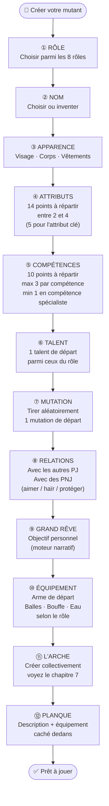
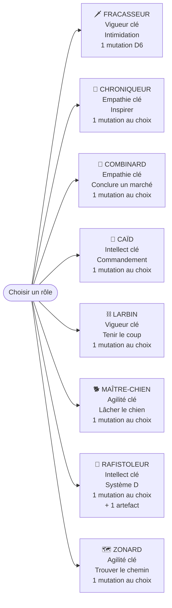
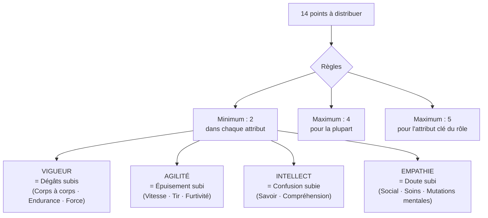
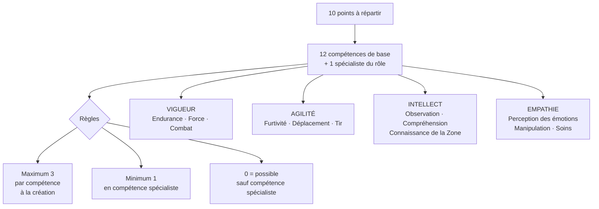
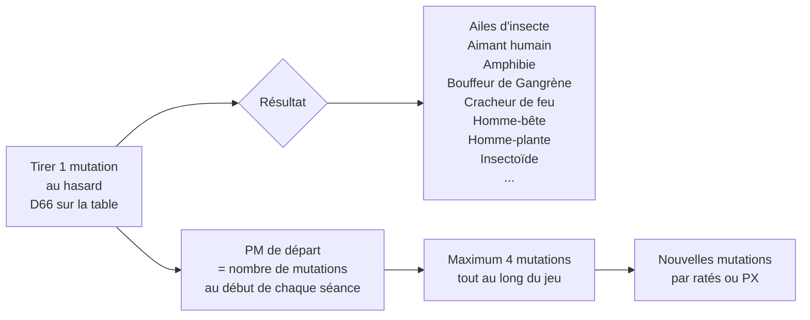
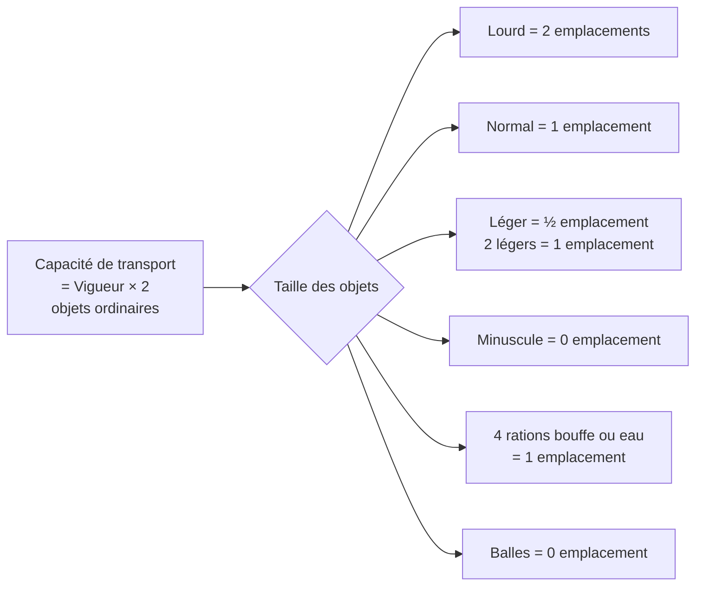
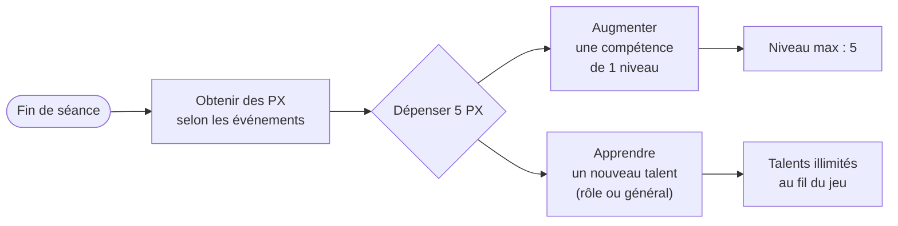

# Création de Personnage — Guide Complet

> Suivre les 12 étapes dans l'ordre.

---

## Diagramme des 12 étapes

---

## Les 8 Rôles

---

## Étape ④ — Répartition des Attributs

| Rôle | Attribut clé (max 5) |
|---|---|
| Fracasseur | Vigueur |
| Larbin | Vigueur |
| Maître-chien | Agilité |
| Zonard | Agilité |
| Chroniqueur | Empathie |
| Combinard | Empathie |
| Caïd | Intellect |
| Rafistoleur | Intellect |

---

## Étape ⑤ — Compétences

---

## Étape ⑥ — Talents de départ par rôle

| Rôle | Talents disponibles (choisir 1) |
|---|---|
| **Fracasseur** | Coup vicieux · Cruel · Passage en force |
| **Chroniqueur** | Agitateur · Toubib · Troubadour |
| **Combinard** | Info croustillante · Magouilleur · Vicelard |
| **Caïd** | Commandant · Détrousseur · Flingueurs |
| **Larbin** | Blasé · Dur à cuire · Rebelle |
| **Maître-chien** | Chien de combat · Le meilleur ami du mutant · Limier |
| **Rafistoleur** | Fou du volant · Inventeur · Rétameur |
| **Zonard** | Chasseur de monstres · Dénicheur de Gangrène · Récupérateur |

---

## Étape ⑦ — Mutation de départ

> Le Fracasseur (livret d'intro) tire sur une table D6 restreinte. En campagne complète, utiliser la table D66 du [[Mutations/Table-mutations-D66|chapitre 5]].

---

## Étape ⑩ — Équipement de départ par rôle

| Rôle | Balles | Bouffe | Eau | Arme(s) | Spécial |
|---|---|---|---|---|---|
| **Fracasseur** | D6 | 2D6 | D6 | Batte cloutée · Poing américain · Hache | — |
| **Chroniqueur** | D6 | D6 | D6 | Aucune | — |
| **Combinard** | 2D6 | 2D6 | D6 | Couteau · Poing américain · Derringer | — |
| **Caïd** | 2D6 | 2D6 | D6 | Batte cloutée · Couteau · Pistolet | — |
| **Larbin** | 0 | D6 | D6 | Batte cloutée · Chaîne de vélo · Fronde | — |
| **Maître-chien** | D6 | D6 | D6 | Chaîne · Couteau · Fronde · Fusil | **Le chien** |
| **Rafistoleur** | 2D6 | D6 | D6 | Poing américain · Chaîne · Pistolet | **1 artefact** |
| **Zonard** | D6 | D6 | 2D6 | Fusil de fortune · Arc (5 flèches) | — |

---

## Encombrement

---

## Progression (après création)

---

## Liens utiles

- [[Roles/Fracasseur|Fracasseur]] · [[Roles/Chroniqueur|Chroniqueur]] · [[Roles/Combinard|Combinard]] · [[Roles/Caid|Caïd]]
- [[Roles/Larbin|Larbin]] · [[Roles/Maitre-chien|Maître-chien]] · [[Roles/Rafistoleur|Rafistoleur]] · [[Roles/Zonard|Zonard]]
- [[Mutations/Table-mutations-D66|Table des Mutations (D66)]]
- [[../Mecanique/Regles-des-jets|Règles des jets de dés]]
- [[../Mecanique/Traumatismes|Traumatismes]]
- [[../Mecanique/Arche-developpement|L'Arche — Développement (étape ⑪)]]
- [[../../Regles/Competences/Commandement|Compétences de spécialiste]]
